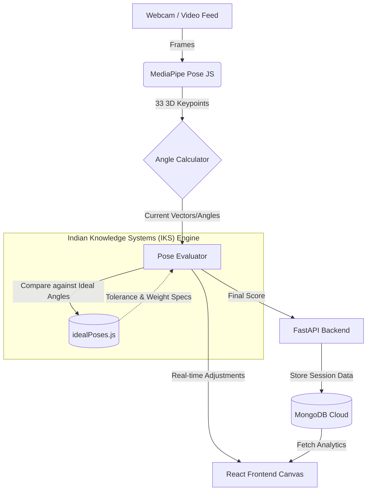

# Sankrityayana: Project Overview & Architecture

**Sankrityayana** is a revolutionary AI-powered Yoga Coach built for the **Chanakya IKS Software Hackathon**. It seamlessly blends modern **Computer Vision** with deep-rooted **Indian Knowledge Systems (IKS)** to provide practitioners with real-time, mathematically precise posture correction.

---

## The Vision

Traditional yoga (IKS) emphasizes precise alignment (*Asana*) to maximize health benefits and prevent injury. However, learning yoga at home often lacks the critical feedback a teacher provides. Sankrityayana bridges this gap by turning your webcam into an intelligent, knowledgeable yoga instructor.

By tracking 33 skeletal keypoints in real-time and applying rigorous vector mathematics, the system calculates joint angles and compares them against the ideal classical alignments described in yogic texts.

---

## Features

- **18 Classical Asanas**: Supports a wide range of poses from beginner (Balasana) to advanced balancing poses, all verified with IKS principles.
- **Microsecond Real-Time Tracking**: Built on Google's MediaPipe Pose model, tracking human topology at 30+ FPS directly in the browser.
- **Intelligent Feedback Engine**: Doesn't just say "wrong"; it gives specific, actionable corrections (e.g., "Bend your front knee to 90 degrees", "Straighten your back leg").
- **Live Scoring**: A dynamic 0-100 score visually guides you into the perfect alignment.
- **Session History & Analytics**: Tracks your progress and best scores over time.

---

## Architecture Diagram

The system uses a decoupled, full-stack architecture prioritizing speed (running ML inference locally in the browser context) and persistence (saving telemetry in the cloud).

## Technical Components

1. **Frontend (React/Vite)**
   - Houses the UI, Webcam feed, and the core Machine Learning execution.
   - Pushing MediaPipe to the client side ensures **zero video latency** and **100% privacy** (video never leaves your device).
   - Generates the real-time visual skeleton overlay (`PoseCamera.jsx`).

2. **Math & Evaluation Engine (`utils/`)**
   - **`angleCalculator.js`**: Calculates the 2D/3D angle between any 3 points using dot-product vectors.
   - **`idealPoses.js`**: The IKS ground truth. Every asana is defined by critical joints, ideal angles, acceptable tolerances, and weighting factors.
   - **`poseEvaluator.js`**: Scores the user based on how close their actual calculated angles are to the ideal definitions.

3. **Backend & Persistence (FastAPI/MongoDB)**
   - Minimal, lightning-fast Python API for storing session telemetry.
   - Provides endpoints for saving session averages, best scores, and history dashboard generation.
